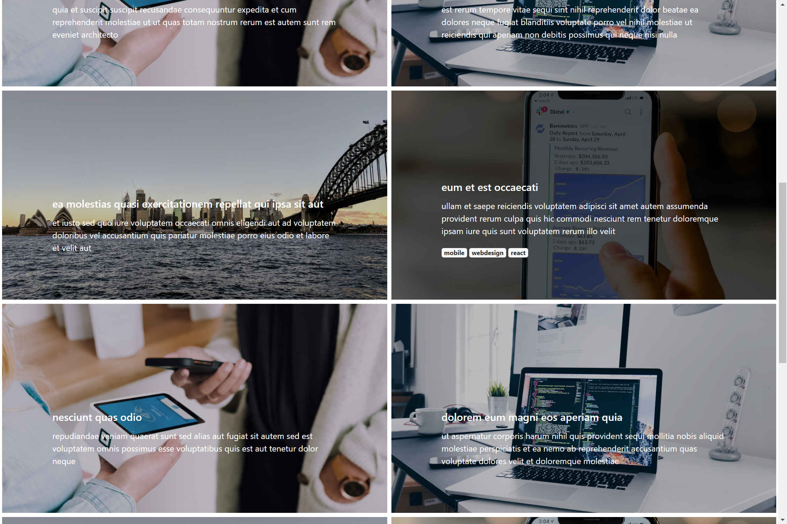

# Portfolio CMS

A dead simple cms for web portfolios. Made with only vanilla javascript, Bootstrap and Google Firebase (or any other NoSQL database).

<!-- 
 -->

## General Information and Settings

**author** _String_
Name of the portfolio author.

**bio** _String_
Short biography of the author.

**authorImage** _String_
Image/Portrait of the portfolio author.

## Portfolio Items

**id** _String_
Unique ID of the portfolio item. Given by Firebase

**title** _String_
Title of the portfolio item.

**content** _String_
Content/Text of the portfolio item.

**excerpt** _String_
Excerpt of the content, preferably one sentence. Used to display the item in the portfolio.

**image** _url to jpg/png-file_
Feature image of the portfolio item.

**tags** _Array of Strings_
Tags of the portfolio item.
